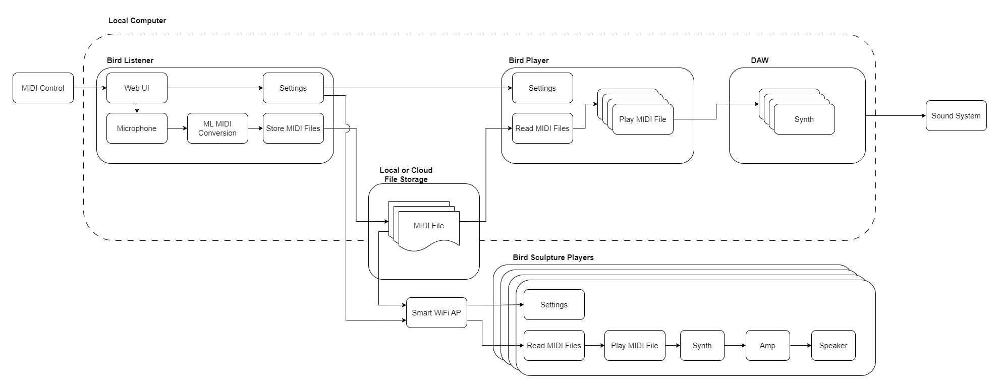

# Bird Listener

Electron application for for recording and transcribing audio using 
Magenta Music `Onsets and Frames`. Based on [Piano Scribe](https://piano-scribe.glitch.me/).

Has the option to start multiple, assignable MIDI players 
to play the output of the process. 

<a href="https://www.vecteezy.com/free-vector/ears">Ears Vectors by Vecteezy</a>